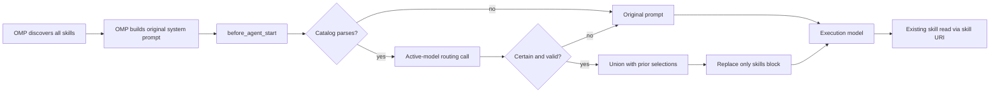

# Progressive Skill Routing Design

## Status

Approved design for implementation in `omp-pantheon`.

## Problem

OMP already implements progressive disclosure for skill bodies: the system prompt lists each visible skill by name and description, and the model reads the selected `SKILL.md` through `skill://<name>`. The remaining overload is the startup registry itself.

A probe against the active discovery configuration found 289 visible skills requiring an estimated 30,030 tokens:

| Provider | Skills | Estimated tokens |
| --- | ---: | ---: |
| `claude-plugins` | 173 | 21,131 |
| `claude` | 23 | 3,004 |
| `omp-managed` | 51 | 2,958 |
| `custom` | 23 | 1,454 |
| `native` | 18 | 1,404 |
| `agents` | 1 | 79 |

The catalog is rendered by OMP as a `<skills>` block in the first system-prompt segment. Skill bodies are not part of this cost.

## Goal

Remove the full skill catalog from the execution model's normal context while preserving all existing skill discovery, routing, loading, commands, paths, and downstream behavior.

## Non-goals

- Rewriting or shortening skill descriptions.
- Hiding, disabling, deleting, or statically allowlisting skills.
- Changing `skill://` resolution or slash-command behavior.
- Changing skill precedence, provider discovery, collision handling, or frontmatter semantics.
- Loading skill bodies before the execution model selects them.
- Changing tools, project context, memory, rules, agents, or user-visible workflow.

## Invariants

1. OMP remains the source of truth for discovered skills and their rendered order.
2. Every skill available before this change remains available through the same `skill://<name>` URI and command surfaces.
3. Only the `<skills>` block in the first system-prompt segment may be replaced. Every byte outside that block remains unchanged.
4. The execution model receives the original catalog whenever routing cannot prove a safe compact result.
5. A skill selected earlier in the session is never removed from later turns.
6. Routing never executes tools, reads skill bodies, mutates files, or changes session state beyond its in-memory selected-name set.
7. Credentials, prompts, router responses, and skill descriptions are not persisted by this feature.

## Architecture

### `skill-routing/catalog.ts`

A pure parser and renderer for the existing OMP `<skills>` block.

It accepts the complete `string[]` system prompt supplied to `before_agent_start` and returns:

- the exact first-segment prefix before `<skills>`;
- ordered `{ name, description, line }` entries;
- the exact suffix after `</skills>`;
- untouched remaining system-prompt segments.

Parsing is fail-closed for compaction: missing markers, nested markers, malformed entries, duplicate names, or an empty catalog produce an unusable result. The caller then returns the original prompt.

Rendering reuses the original catalog lines rather than reconstructing descriptions. This preserves names, punctuation, provider order, and description bytes.

### `skill-routing/router.ts`

A router calls the active model through `@oh-my-pi/pi-ai` using the credential resolver from `ctx.modelRegistry`. Its context contains only:

- a fixed routing instruction;
- the current user prompt;
- the ordered skill catalog;
- names already selected in this session.

The router returns strict JSON:

```json
{
  "skills": ["skill-name"],
  "confidence": "certain" | "uncertain"
}
```

Rules supplied to the router:

- select every skill whose trigger applies, including process skills;
- do not select by general usefulness;
- return `uncertain` whenever the prompt is ambiguous or the catalog is insufficient;
- never invent names;
- return an empty list only when no skill applies.

The active execution model is used rather than a cheaper role so routing retains the same model family and semantic capability as the unmodified flow. The call uses no tools and a bounded output budget.

The response is accepted only when:

- it is valid JSON with no surrounding text;
- it matches the exact schema;
- every returned name exists in the parsed catalog;
- names are unique;
- confidence is `certain`;
- the call completes within its deadline.

Any violation returns a fail-open result.

### `skill-routing/runtime.ts`

The runtime registers one `before_agent_start` handler.

For each turn it:

1. Parses the current system prompt.
2. Routes the current user prompt against the complete catalog.
3. Unions newly selected names with the session's previously selected names.
4. Replaces the catalog with the original lines for that ordered union.
5. Returns the modified `systemPrompt` while leaving all other segments untouched.

The selected-name set is process-local to the extension instance and is cleared when the session shuts down. Catalog order, not router response order, controls rendering.

If parsing, model resolution, credential resolution, completion, validation, or timeout fails, the handler returns the original `event.systemPrompt`. The feature must never block a user turn because routing failed.

### Entrypoint

`extensions/oh-my-omp/index.ts` registers the routing runtime alongside existing hooks. The existing `resources_discover` handler remains unchanged, so OMP still discovers and activates the complete skill set before routing.

## Data Flow



## Failure Semantics

The optimization is fail-open to existing behavior:

| Failure | Result |
| --- | --- |
| No active model | Original prompt |
| Missing credentials | Original prompt |
| Router timeout or provider error | Original prompt |
| Invalid JSON or schema | Original prompt |
| Unknown or duplicate skill name | Original prompt |
| Router reports uncertainty | Original prompt |
| Catalog cannot be parsed exactly | Original prompt |
| Empty certain selection | Prompt with an empty `<skills>` registry for that turn |

Failures are debug-logged with reason and counts only. Logs must not contain the user prompt, skill descriptions, credentials, or model response.

## Compatibility

The implementation changes neither the discovered `Skill[]` nor OMP's active-skill snapshot. Therefore:

- `skill://` resolution continues to use the complete original registry;
- manual `/skill:<name>` invocation remains available;
- hidden and `disable-model-invocation` skills retain their existing behavior;
- provider precedence and duplicate resolution remain OMP-owned;
- reloads and newly discovered catalogs are parsed from the fresh system prompt;
- other `before_agent_start` handlers continue to receive and chain system-prompt replacements under OMP's existing ordering rules.

The handler must derive its input from `event.systemPrompt`; it must not scan skill directories independently. This avoids introducing a second discovery convention.

## Tests

### Unit contracts

- Parse and render a realistic catalog without byte drift.
- Reject malformed, duplicate, nested, missing, and empty catalog structures.
- Preserve every system-prompt byte outside `<skills>`.
- Preserve original catalog ordering and line bytes.
- Accept only strict, certain, known-name router responses.
- Accumulate selected skills across turns without duplicates.
- Return the original prompt for every failure class.
- Emit metadata-only logs.

### Extension integration

- Register `before_agent_start` without altering current registrations.
- Confirm `resources_discover` still exposes the same Pantheon skills directory.
- Confirm selected skills remain readable through the unchanged active skill registry.
- Confirm manual skill commands are unaffected.

### Evaluation evidence

A routing evaluation uses representative prompts for:

- a single domain skill;
- multiple simultaneous skills;
- mandatory process plus domain skill;
- no applicable skill;
- ambiguous routing requiring fallback;
- a task switch that retains an earlier selection.

For each case, compare the selected skill names with a full-catalog baseline using the same model. The acceptance bar is exact set equality for all deterministic cases and original-prompt fallback for ambiguity.

A context probe records:

- full catalog skill count and estimated tokens;
- routed catalog skill count and estimated tokens;
- unchanged non-skill system-prompt digest;
- whether fallback occurred.

## Acceptance Criteria

1. The execution request omits unselected catalog entries after a certain routing result.
2. The non-skill system prompt is byte-identical before and after routing.
3. All discovered skills remain reachable through existing OMP mechanisms.
4. Routing failure restores the exact original prompt and does not fail the user turn.
5. Previously selected skills persist across task changes in the same session.
6. The representative routing evaluation matches the full-catalog baseline.
7. `bun test` and `bun run typecheck` pass.
8. The draft PR includes before/after token evidence and compatibility evidence.

## Rollout

The feature ships as part of the Pantheon extension and operates transparently. No global OMP configuration is mutated. Removal consists only of unregistering the routing runtime; the underlying OMP discovery and prompt construction remain intact.
