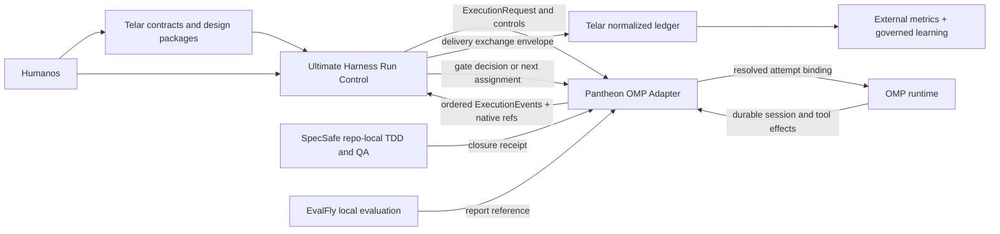

# OMP Pantheon como adapter de ejecución

**Estado:** propuesta provisional de arquitectura. No constituye una decisión aceptada ni una
interfaz implementada.

**Decisión cross-project canónica:**
`Telar/docs/architecture/adrs/ADR-023-separate-delivery-systems-behind-contracts.md`.
Este documento conserva la evidencia y el mapping del Adapter OMP. Si una asignación provisional
de ownership difiere, ADR-023 prevalece: Telar posee política, identidad estable, ledger
normalizado, review/judge policy e interpretación de métricas; Ultimate Harness posee la
resolución y ejecución live como único Run Control.

## Resumen ejecutivo

OMP Pantheon puede jugar un papel valioso como **Adapter de ejecución específico de OMP** para
Telar y Ultimate Harness. Su profundidad no está en definir contratos de producto ni en elegir
modelos: está en reanudar una sesión OMP persistida, entregar trabajo con journal, leases y
fencing, evitar la repetición de efectos ambiguos, invalidar evidencia obsoleta y permitir el
éxito sólo cuando todos los gates requeridos son actuales.

La recomendación provisional es mantener los cuatro productos separados:

- **Telar** es dueño de los contratos portables `feature`, `slice`, `release` y `project`, del
  paquete de diseño, intención de negocio, política económica y de calidad, identidad estable,
  autoridad humana, ledger normalizado, política de revisión/juez e interpretación de métricas.
- **Ultimate Harness** es el único Run Control: resuelve la ruta live dentro de la política Telar,
  vincula el modelo/runtime real al intento, aplica límites operativos, ejecuta fallbacks,
  sandboxes, revisión/integración y devuelve receipts inmutables.
- **SpecSafe** sigue siendo repo-local y dueño del ciclo de slice, TDD y QA.
- **Pantheon** ejecuta una asignación ya resuelta sobre OMP y emite eventos y referencias de
  evidencia. No decide el contrato, el modelo, el budget ni la autoridad de release.

No conviene mergear Pantheon con Telar ni presentar sus agentes Markdown como el plano de control
del sistema. Tampoco conviene extraer todavía un paquete compartido: con un solo Adapter real, esa
abstracción sería hipotética. La extracción se justifica cuando un segundo ejecutor demuestre el
mismo Interface.

### Vocabulario canónico

| Término | Significado | Producto |
|---|---|---|
| Execution Harness | Substrato que hospeda sesiones, providers, tools y trayectorias nativas. | OMP en este lane. |
| Meta Harness | Único Run Control cross-harness que resuelve y supervisa intentos live. | Ultimate Harness. |
| Orchestrator | Intención de negocio, lifecycle policy, identidad estable, autoridad, ledger normalizado y learning gobernado. | Telar; nunca lanza o reintenta un intento live. |
| Repo-local Assurance | Readiness, trace, TDD, verify, QA y completion local. | SpecSafe. |
| OMP Execution Adapter | Traducción y ejecución durable específica de OMP detrás del seam de UH. | OMP Pantheon. |

“Cellar” es un error de transcripción de **Telar**. Meta Harness es una
capacidad de UH, no un quinto producto; Orchestrator no significa un segundo
Run Control.

## Alcance y base de evidencia

Este análisis cubre el código y la documentación versionados de Pantheon. No valida el diseño
interno actual de Telar ni Ultimate Harness; por eso la asignación entre ambos es una hipótesis que
debe reconciliarse con sus Interfaces reales antes de aceptar una ADR.

La inspección separa la base versionada de cambios locales ajenos. En particular, no atribuye como
capacidad actual ninguna variante local del comando `ultrawork` ni ningún runtime de loop no
versionado. La propia documentación declara que Ralph/ULW ya no es un runtime de persistencia y
que `/autonomy` lo reemplaza para ese propósito ([autonomy](autonomy.md#migration-from-ralphulw-runtime)).

Las fuentes principales son:

- el composition root de la extensión ([index.ts](../extensions/oh-my-omp/index.ts));
- el estado, gates y ciclo durable de autonomía
  ([types.ts](../extensions/oh-my-omp/autonomy/types.ts),
  [runtime.ts](../extensions/oh-my-omp/autonomy/runtime.ts));
- el journal, scheduler, daemon y worker reanudable
  ([journal.ts](../extensions/oh-my-omp/autonomy/journal.ts),
  [scheduler.ts](../extensions/oh-my-omp/autonomy/scheduler.ts),
  [agentd.ts](../extensions/oh-my-omp/autonomy/agentd.ts),
  [worker.ts](../extensions/oh-my-omp/autonomy/worker.ts));
- los adapters de evidencia
  ([EvalFly](../extensions/oh-my-omp/evalfly/enforcement-gate.ts),
  [SpecSafe](../extensions/oh-my-omp/specsafe-receipts.ts));
- el ledger de refinamiento ([ledger.ts](../extensions/oh-my-omp/refinement/ledger.ts));
- las notas que registran diferencias del port de SpecSafe
  ([hooks-PORT-NOTES](hooks-PORT-NOTES.md));
- las pruebas de comportamiento bajo [`test/`](../test/) y las pruebas repo-locales de cada
  skill.

## Mapa del sistema propuesto



El diagrama expresa autoridad, no despliegue. Pantheon puede correr en el mismo host que OMP, pero
el ledger portable y las decisiones de routing no deben derivarse de sus archivos privados.

## Arquitectura actual de Pantheon

Pantheon es un harness sobre OMP, no un runtime fundacional. OMP aporta proveedores, modelos,
sesiones, tools y subagentes. Pantheon distribuye archivos descubiertos por OMP y registra una
extensión que añade autonomía verificable, hooks, refinamiento, ejecución de Python skills y
adapters de evidencia.

| Module actual | Interface o Seam observable | Implementation / Adapter | Profundidad y límite |
|---|---|---|---|
| Distribución e instalación | Convención de archivos de OMP | `install.sh`, agentes, comandos y skills Markdown | Glue superficial pero necesario; no debe convertirse en autoridad de contratos. |
| Composition root OMP | `ExtensionAPI`, discovery y eventos de sesión | `extensions/oh-my-omp/index.ts` | Acoplamiento explícito a OMP; es el lugar natural del Adapter, no un Interface portable. |
| Autonomy control | `/autonomy start/status/pause/resume/cancel/explain` | `AutonomyRuntime` y `AutonomyController` | Profundo: propiedad de sesión, intentos acotados, gates por reporter y revisión de artefacto. La entrada sigue siendo una tarea textual, no un contrato por nivel. |
| Persistencia de objetivo | Snapshot y journal checksummed | `AutonomyStore` | Profundo: CAS, archivos privados, rechazo de corrupción y éxito sólo con gates actuales. Es estado operacional local, no ledger organizacional. |
| Entrega durable | Estados `queued`, `claimed`, `dispatched`, `acknowledged`, `failed`, `uncertain` | journal, scheduler, `pantheon-agentd`, worker | Profundo: leases, fencing, recuperación y no-replay después de dispatch. |
| Verificación | Gate tipado por requirement y reporter | goal nativo, comando host, adapters EvalFly y SpecSafe | Profundo en frescura e invalidación; estrecho en tipos de gate y sin gate humano general. |
| SpecSafe port | Estado de slice y closure receipt | skill CLI, hooks y adapter | Integración útil, pero el dominio pertenece a SpecSafe. El port no acumula tokens ni coste y no puede inyectar identidad por spawn. |
| EvalFly | Config, casos, reportes y gate opt-in | CLI, trace buffer y enforcement adapter | Parcial: el juez ejecutable actual es determinista `file_exists`; LLM y humano son schema sin Implementation. La traza es acotada y en memoria. |
| Agentes y revisión | Persona Markdown con lista ordenada de modelos | `agents/*.md`, comandos de orquestación | Conveniente como frontend, pero mezcla identidad con fallback y no prueba fan-out, adjudicación ni juez independiente. |
| Fallback audit | Eventos de retry de OMP | hook JSONL local | Sólo observabilidad; OMP decide el fallback. No es routing económico. |
| Refinamiento | Ciclo propuesto, validado, aprobado, activo, rollback | ledger, snapshots y comando humano `/refinement` | Profundo y distintivo: aprobación, hashes, conflicto, cuarentena y rollback. Debe quedar como extensión separada del Adapter de ejecución. |
| Python skills | Manifest de ejecución acotada | runner y cache de entornos | Profundo y opcional. No forma parte del Interface mínimo del ejecutor; stock Pantheon no trae Adapter de sandbox de red. |
| Checkpoints y retained agents | Interfaces backend inyectables | Implementations unsupported | Seam hipotético: stock OMP no expone las capacidades necesarias. No debe anunciarse como capacidad portable. |

### Runtime y persistencia

El flujo de autonomía requiere una sesión OMP persistida; `--no-session` se rechaza. El worker
reabre esa sesión mediante la interfaz pública de OMP, espera idle, hace flush y sólo entonces
acknowledges el comando. Un comando se registra antes de ejecutarse y queda `dispatched`
inmediatamente antes del prompt. Si el proceso cae después de ese punto, Pantheon marca el estado
como `uncertain` y no repite efectos potenciales. Esta semántica es la capacidad exclusiva más
importante para conservar.

La ejecución no es infinita: tiene `maxAttempts`. La persistencia significa reanudación hasta
éxito verificable o un terminal explícito, no un loop sin límite. El Definition of Done actual se
aproxima mediante un objetivo OMP textual exacto más gates; no existe todavía como contrato
portable con niveles `feature/slice/release/project`.

### Gates y evidencia

Los gates actuales registran reporter, intento y revisión del artefacto. Cualquier tool
potencialmente mutante avanza esa revisión e invalida los gates, incluso si la tool falla. La
verificación de host usa lease y fingerprint para rechazar resultados tardíos. La prosa del modelo
no cuenta como evidencia.

Esta disciplina sí debe sobrevivir en el Adapter. Lo que no debe sobrevivir como contrato externo
es el detalle de `ownerSessionFile`, rutas privadas, comandos del broker o formatos internos del
journal. Esos son detalles de la Implementation OMP.

El gate de SpecSafe valida una instancia y receipt concretos. El gate de EvalFly valida suite,
rango, frescura y reporte canónico cuando su enforcement está activado. Ambos son adapters de
evidencia, no la fuente universal del ledger.

### Routing, identidad y budgets

Pantheon conserva la identidad nominal del agente y puede observar el modelo resuelto, pero muchos
archivos de persona incluyen su propia lista ordenada de modelos. Esto separa nombre y modelo en la
traza, pero no separa todavía las autoridades: la persona también prescribe fallback.

No existe un router que optimice coste o latencia, un budget agregado por contrato, ni enforcement
de tokens o dólares. El `CostCounter` de SpecSafe mantiene la forma heredada, pero el port de OMP
no lo muta. EvalFly puede sumar metadatos de coste de una traza y señalar casos caros, sin imponer
un límite. El hook de fallback sólo audita decisiones tomadas por OMP.

### Revisión, juez, DORA y learning loop

Hay personas de reviewer para distintos modelos y comandos que pueden solicitar revisión, pero no
un módulo programático que garantice revisión multimodelo independiente, fan-out, deduplicación y
adjudicación. Tampoco hay un juez con paquete de contexto mínimo ni aislamiento verificable del
historial del ejecutor.

EvalFly y el ledger de refinamiento son buenos seams para un learning loop: uno produce evidencia
y el otro exige validación y aprobación antes de activar una mejora. La promoción automática de
trazas a evals, el muestreo, la separación hidden/development y la atribución de resultado todavía
faltan. Pantheon no calcula DORA; esas métricas requieren eventos de Git, CI y despliegue que deben
correlacionarse en el ledger normalizado de Telar.

## Matriz de capacidades frente al sistema deseado

| Capacidad deseada | Evidencia actual en Pantheon | Estado | Dueño propuesto |
|---|---|---|---|
| Contratos `feature/slice/release/project` | `/autonomy` recibe una tarea textual y un objetivo exacto | Ausente | Telar |
| Paquete de diseño | Skills y prompts pueden producir artefactos, sin contrato canónico | Ausente | Telar |
| Routing económico y multimodelo | Listas de modelos en personas; retry/fallback de OMP observado | Parcial, no gobernado | Telar define política; Ultimate Harness resuelve/ejecuta; Pantheon reporta |
| Identidad separada de modelo/fallback | Traza distingue agente y modelo; la persona aún prescribe modelos | Parcial | Telar mantiene identidad estable; UH vincula el intento; Pantheon reporta la ruta observada |
| Ledger trazable | Journals operacionales y receipts checksummed | Nativo local, no agregado | Telar normaliza referencias; UH y Pantheon conservan receipts nativos |
| Gates programáticos | Goal, comando host, EvalFly y SpecSafe con frescura | Nativo y profundo | Telar compone política; SpecSafe evalúa local; UH/Pantheon ejecutan controles permitidos |
| Gates humanos | `--i-approve` y `/refinement` cubren casos estrechos | Parcial | Telar conserva autoridad; UH/Pantheon consumen una decisión atribuida |
| TDD/QA repo-local | Skill, estado y receipts SpecSafe | Nativo como port | SpecSafe |
| Persistencia hasta Definition of Done | Reanudación durable, intentos acotados y gates | Parcial | Ultimate Harness controla; Pantheon ejecuta |
| Revisión multimodelo | Personas y prompts por modelo | Parcial, no demostrada | Telar define independencia; UH ejecuta misiones; Pantheon puede ser Adapter |
| Juez con contexto mínimo | No hay bundle mínimo ni juez aislado; LLM/human EvalFly no ejecutan | Ausente | Telar define policy; SpecSafe compila contexto; UH ejecuta |
| Budgets | `maxAttempts`; coste/tokens sólo metadata incompleta | Parcial | Telar autoriza; UH aplica límites live; Pantheon aplica sólo capacidades probadas |
| DORA | Sin cálculo ni fuentes de deploy | Ausente | Sistemas externos calculan; Telar correlaciona/interpreta |
| Learning loop | EvalFly más refinamiento aprobado | Parcial, manual | Telar gobierna propuestas; Pantheon conserva refinamiento local aprobado |
| Checkpoints de kernel | Backend definido, stock OMP unsupported | Hipotético | Futuro Adapter, sólo si OMP ofrece Seam público |
| Retained agents | Backend definido, stock OMP unsupported | Hipotético | Futuro Adapter, sólo si OMP ofrece Seam público |

## Deletion test

El test pregunta dónde reaparece la complejidad si se elimina cada Module. Si sólo desaparece una
capa de forwarding, es superficial; si la complejidad invade callers, el Module tiene profundidad.

| Module eliminado | Qué sucede | Resultado |
|---|---|---|
| Autonomy store, journal, scheduler y worker | Run Control tendría que reconstruir CAS, leases, fencing, persistencia de sesión y semántica `uncertain` específica de OMP | Profundo; conservar detrás del Adapter |
| Revisión de artefacto y reporters de gate | Cada integrador tendría que resolver evidencia tardía, mutación posterior y evidencia inventada por el modelo | Profundo; conservar como invariantes |
| Adapter EvalFly | El caller tendría que reimplementar suite/rango/frescura/reporte canónico | Seam real; conservar como Adapter opcional |
| Adapter y receipts SpecSafe | El caller tendría que interpretar estado y recuperación de closure; mantener el dominio duplicaría SpecSafe | Conservar sólo el Adapter; no absorber el dominio |
| Refinement ledger | Aprobación, hashes, conflicto, activación y rollback se dispersan entre prompts y scripts | Profundo; conservar como Module separado |
| Python skill runner | Sandboxing, manifests, cache y límites reaparecen en cada skill ejecutable | Profundo pero opcional; fuera del Interface mínimo |
| Agentes y comandos Markdown | La mayor parte de la conducta puede migrar a contratos y routing del plano superior | Superficial o duplicada como control; conservar sólo como UX OMP |
| Instalador y composition root | Desaparece el empaquetado, pero no la semántica del sistema | Glue necesario; no elevarlo a arquitectura portable |
| Fallback audit | Se pierde telemetría local, sin cambiar la selección de modelo | Observabilidad superficial para routing |
| Checkpoints y retained agents actuales | No se pierde una Implementation funcional | Interface hipotético; no compartir todavía |

## Interface propuesto para el Adapter

El siguiente contrato es un bosquejo de diseño, no TypeScript para incorporar en esta fase. Busca
un Interface profundo con tres operaciones y evita filtrar el grafo interno de Pantheon.

```ts
type ContractLevel = "feature" | "slice" | "release" | "project";

interface ExecutionRequest {
  schemaVersion: "telar.execution.v1";
  executionId: string;
  contract: {
    level: ContractLevel;
    ref: string;
    objective: string;
    definitionOfDone: readonly string[];
    designPackageRef: string;
    repository: { locator: string; revision: string };
  };
  identity: { agentId: string; role: string; instructionsRef: string };
  modelBinding: {
    provider: string;
    model: string;
    routingDecisionRef: string;
  };
  limits: {
    maxAttempts: number;
    deadline?: string;
    maxTokens?: number;
    maxCostUsd?: number;
  };
  gates: readonly GateRequirement[];
}

interface ExecutionAdapter {
  describe(): Promise<ExecutionCapabilities>;
  execute(
    request: ExecutionRequest,
    controls: AsyncIterable<ControlSignal>,
  ): AsyncIterable<ExecutionEvent>;
  inspect(ref: ExecutionRef): Promise<ExecutionSnapshot>;
}
```

`identity` y `modelBinding` son campos distintos. Pantheon recibe la decisión de routing ya
resuelta y reporta el modelo observado; no elige ni modifica esa decisión. Si OMP aplica un
fallback, el Adapter debe emitir la nueva vinculación con la referencia a la decisión o marcar una
violación de política, según el contrato de Ultimate Harness.

### Eventos y evidencia

El stream mínimo debe poder representar:

- aceptación idempotente y comienzo de intento;
- identidad y modelo efectivamente vinculados;
- comando claimed, dispatched, acknowledged, failed o uncertain;
- mutación y nueva revisión de artefacto;
- referencia de evidencia producida;
- transición de gate y espera humana;
- pausa, cancelación, éxito o fallo terminal.

Cada evento necesita `executionId`, secuencia monotónica, timestamp, intento, revisión de
artefacto y digest. Una referencia de evidencia necesita `kind`, `ref`, `digest`, `reporter`,
`attempt` y `artifactRevision`. El evento no debe contener prompts, razonamiento, credenciales,
rutas privadas ni el contenido completo de sesiones.

### Invariantes del Interface

1. `executionId` más el hash del request es idempotente; el mismo ID con otro hash se rechaza.
2. Pantheon no muta el ciclo de vida del contrato Telar ni decide release.
3. Éxito exige todos los gates requeridos en el mismo intento y revisión de artefacto.
4. Una mutación posterior invalida toda evidencia dependiente del artefacto.
5. Después de `dispatched`, un resultado ambiguo se emite como `uncertain` y nunca se repite de
   forma automática.
6. Pausa, cancelación y decisiones humanas llegan como controles trazables, no como prosa del
   modelo.
7. Los límites de coste o tokens se hacen cumplir fuera de Pantheon hasta que el Adapter declare
   esa capacidad y pueda probarla; `maxAttempts` sí puede delegarse al runtime actual.
8. Las rutas privadas y el archivo de sesión OMP permanecen dentro de la Implementation.

### Mapeo hacia la Implementation actual

| Concepto portable | Seam actual | Cambio de diseño futuro requerido |
|---|---|---|
| `executionId` y snapshot | `AutonomyRun.id` y store | Fachada estable sin exponer rutas privadas |
| Objetivo y DoD | `task`, native goal y gates | Traducir contrato por nivel a objetivo/gates sin perder su hash |
| Controles | métodos start/pause/resume/cancel | Entrada externa autenticada y eventos correlacionados |
| Eventos de entrega | journal, scheduler y terminal intent | Proyección append-only, vía UH, al ledger normalizado de Telar |
| Evidencia | gate records y receipts | Envelope portable con digest y referencia |
| Identidad/modelo | agente Markdown y modelo observado | Recibir asignación externa; retirar la lista de fallback como autoridad |
| Límites | `maxAttempts` | Telemetría/enforcement de tiempo, tokens y coste |
| Gate humano | `/refinement` y `--i-approve` | Decisión general, atribuida y vinculada al contrato |

## Opciones de integración

| Opción | Ventajas | Costes y riesgos | Evaluación |
|---|---|---|---|
| Sistemas separados, Pantheon como Adapter OMP | Preserva especialización, evita doble autoridad y permite reemplazar executor | Requiere contrato de eventos y traducción de gates | **Recomendada ahora** |
| Compartir un paquete neutral de contratos/eventos | Reduce drift cuando existen varios executors | Con un solo Adapter congela una abstracción no probada | Posponer hasta un segundo Adapter conforme |
| Mergear Pantheon dentro de Ultimate Harness | Un solo despliegue y acceso directo a internals | Acopla Run Control a OMP y filtra journal/session semantics | No recomendado |
| Mergear Pantheon dentro de Telar | Contrato y ejecución en un repo | Confunde intención de producto con runtime; limita portabilidad | No recomendado |
| Dejar Pantheon como colección de prompts | Adopción mínima | Pierde persistencia, gates objetivos y recuperación, que son su Leverage real | Rechazado por deletion test |

## Recomendación provisional

1. Definir primero el contrato de lifecycle/ledger de Telar y el envelope de ejecución de
   Ultimate Harness.
2. Crear después una fachada de Pantheon que implemente ese Interface usando `AutonomyRuntime`,
   sin exportar store, journal, scheduler ni archivos de sesión.
3. Mantener SpecSafe como autoridad repo-local; Pantheon sólo consume su receipt canónico.
4. Tratar EvalFly como productor/adaptador local de evidencia mientras no haya juez LLM/humano
   ejecutable. No usar su schema como prueba de capacidad.
5. Mover la autoridad de modelos/fallback fuera de las personas Pantheon. Las personas pueden
   seguir siendo instrucciones, pero reciben un `modelBinding` resuelto.
6. Proyectar eventos Pantheon, a través de UH, al ledger normalizado de Telar; no convertir sus
   archivos privados en el ledger portable.
7. Conservar el refinement ledger como Module opcional y separado. Integrarlo al learning loop
   mediante referencias de evidencia y aprobación humana, no mediante activación automática.
8. Probar el Interface con un segundo executor antes de extraer un módulo compartido.

## Plan operativo futuro

Pantheon profundiza únicamente el OMP Execution Adapter. El plan no añade
policy, ledger o lifecycle global dentro de este repo.

| Área | Interface y seam | Owner / Adapter | Gate y evidencia | Seguridad / deletion test |
|---|---|---|---|---|
| Interface portable | `describe`, `execute`, `inspect` y `collect` en el seam UH-to-OMP. | UH posee el contrato de conformidad del Run Control; Pantheon posee la Implementation OMP. | Request idempotente, capabilities versionadas, stream ordenado, snapshot y terminal receipt. | Ningún caller importa store, journal, scheduler, session paths o API privada de OMP. |
| Ejecución y lifecycle | Traducir un binding ya autorizado a objetivo, sesión, controles y gates OMP. | Telar gobierna lifecycle; UH es el único Run Control; Pantheon reanuda y ejecuta OMP. | Leases, fencing, revisión de artefacto, gate freshness, cancelación y `dispatched -> uncertain` sin replay. | Borrar Pantheon debe obligar a reconstruir semántica OMP en UH; si sólo borra forwarding, el Adapter es demasiado superficial. |
| Economics | Consumir límites resueltos y emitir uso real disponible. | Telar autoriza policy/budget; UH resuelve y aplica; Pantheon aplica sólo `maxAttempts` u otra capacidad probada. | Requested/actual route, tokens/coste con unidades y fuente, fallback/desviación, y `unknown` explícito. | Pantheon nunca inventa coste, cuota, modelo o channel ni rebaja calidad por precio. |
| Observabilidad | Convertir eventos nativos en referencias allowlisted. | Pantheon conserva journals/receipts locales; UH agrega evidencia operacional; Telar normaliza el ledger. | Producer sequence, attempt, artifact revision, digest, reporter, freshness y redaction class. | Prompts, razonamiento, secrets, rutas privadas y dumps de sesión no cruzan el seam. |
| Identidad | Separar `agentId` estable de `modelBinding` y de IDs de sesión OMP. | Telar mantiene identidad estable; UH vincula run/attempt y ruta; Pantheon reporta el modelo observado. | Cada fallback preserva `agentId` y emite la nueva ruta real o una violación de policy. | Persona Markdown o modelo solicitado no prueban el modelo efectivo. |
| Assurance y review | Consumir requisitos/receipts SpecSafe y ejecutar sólo gates asignados. | SpecSafe es autoridad repo-local; Telar define review/judge policy; UH ejecuta misiones; Pantheon reporta. | RED/mínimo/GREEN/refactor, candidate digest, reviewer independence, judge envelope, human decision. | Un pass local no significa release; evidencia stale, reporter inválido o reviewer no independiente bloquea/inconclusive. |
| Learning | Exportar evidencia/refinement refs sin activación autónoma. | Telar gobierna propuestas cross-project; el owner del artifact publica; Pantheon conserva su refinement Module local. | Evidence window, hypothesis, candidate hash, validación, aprobación humana, activación, rollback y cuarentena. | Ningún evento de ejecución edita personas, skills, policy, tests o sesiones activas automáticamente. |
| Security | Aceptar controles autenticados y aplicar bounds explícitos. | Telar define autoridad; UH valida scope/receipt; Pantheon protege runtime y estado privado. | Actor, request digest, scope, nonce/expiry, controls, allowed effects, cancel/pause y uncertainty resolution. | Authorization stale/forged, ID/hash mismatch, secret/path leakage o ambiguous replay falla cerrado. |
| Evolución | Validar el seam con conformance fixtures antes de compartir código. | Pantheon es primer Adapter OMP; se necesita un executor no-OMP real. | Dos workflows, segundo Adapter y dos ciclos compatibles antes de package común. | Si borrar el package futuro sólo borra types copiados y no redistribuye complejidad, no extraerlo. |

La primera vertical autorizada es no productiva y debe incluir un caso positivo y
uno negativo de `uncertain`, evidencia stale o fallback fuera de policy. Deploy,
efectos destructivos y migración productiva requieren un runbook aprobado por
separado. La sección [Deletion test](#deletion-test) sigue siendo el criterio de
admisión para cada nuevo Module o Adapter.

## Riesgos

| Riesgo | Consecuencia | Mitigación de diseño |
|---|---|---|
| Acoplamiento a versiones de OMP | Cambio de eventos o sesión rompe el Adapter | `describe()` con capabilities y suite de conformidad por versión |
| Doble autoridad de routing | Persona y Ultimate Harness eligen modelos distintos | `modelBinding` resuelto y evento de desviación/fallback |
| Dos SpecSafe divergentes | Slice, costes o receipts inconsistentes | Una sola autoridad repo-local; Pantheon sólo adapta el estado canónico |
| Ledger fragmentado | No se puede reconstruir una decisión end-to-end | Secuencias correlacionadas y referencias con digest en el ledger normalizado de Telar |
| Repetición después de fallo ambiguo | Efectos externos duplicados | Preservar `dispatched -> uncertain`, con resolución humana explícita |
| Falsa capacidad multimodelo | Prompts etiquetados se confunden con revisión independiente | Conformance test de fan-out, aislamiento, adjudicación y modelo observado |
| Fuga de estado privado | Sesiones, prompts o rutas llegan al ledger | Allowlist de campos y referencias opacas; nunca copiar journals crudos |
| Gates demasiado locales | Un test repo-local se interpreta como aprobación de release | Política de composición y autoridad de release en Telar; enforcement mecánico en UH |
| Budgets declarados pero no aplicados | Ejecución excede coste o tokens | Capabilities explícitas; enforcement central hasta tener Adapter verificable |

## Preguntas abiertas antes de una ADR

1. ¿Qué campos exactos pertenecen al contrato lifecycle/ledger de Telar y cuáles al envelope de
   Run Control/Execution Adapter de Ultimate Harness, sin duplicar autoridad?
2. ¿Ultimate Harness ya tiene un Interface de eventos/evidencia que deba adoptarse en lugar del
   bosquejo anterior?
3. ¿Cómo debe reportar Pantheon un fallback nativo de OMP: como una resolución permitida por UH o
   como desviación bloqueante cuando no aparece en la cadena autorizada?
4. ¿Qué gates humanos requieren identidad autenticada, doble aprobación o caducidad?
5. ¿Cuál es la fuente canónica de SpecSafe durante la migración y cómo se elimina el port
   duplicado sin romper receipts existentes?
6. ¿Quién resuelve un comando `uncertain`, y puede esa resolución permitir continuar sin ocultar
   la ambigüedad al release gate?
7. ¿Qué subset de EvalFly seguirá siendo evidencia local y qué referencias normaliza Telar sin
   copiar traces privados?
8. ¿Qué fuentes de Git, CI y despliegue alimentarán DORA y cómo se correlacionarán con
   `executionId` y contract ref?
9. ¿Qué segundo executor se usará para demostrar que el Interface es portable antes de extraer un
   paquete común?
10. ¿Qué versiones de OMP soporta el Adapter y qué suite de conformidad prueba cada capability?

## Criterio para aceptar la arquitectura

Esta propuesta está lista para convertirse en ADR sólo cuando:

- Telar conserve intención, policy, identidad estable, budget authority, ledger y release;
- Ultimate Harness conserve resolución live y ejecución como único Run Control;
- exista un schema versionado de request, control, evento y evidencia;
- Pantheon pruebe reanudación, invalidación de gates, no-replay y proyección de eventos contra ese
  schema;
- SpecSafe conserve una única fuente repo-local;
- identidad y modelo puedan cambiar independientemente sin modificar la persona;
- la revisión multimodelo y el juez demuestren aislamiento y modelo observado;
- DORA y learning loop tengan fuentes y decisiones de promoción explícitas.
